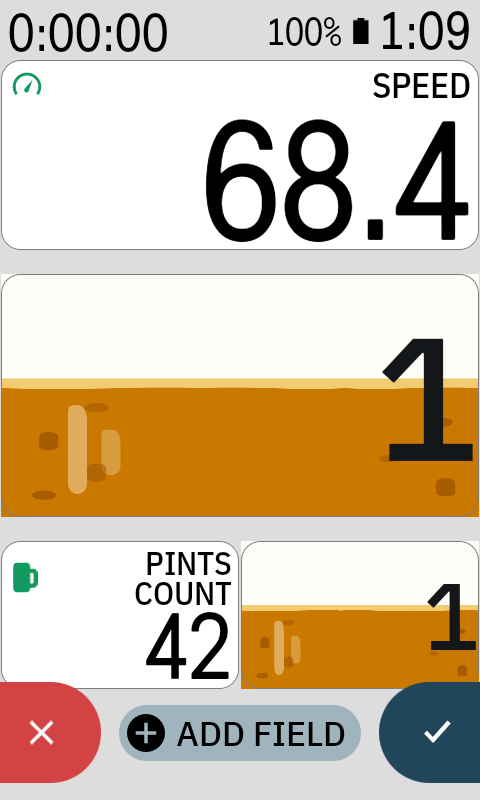
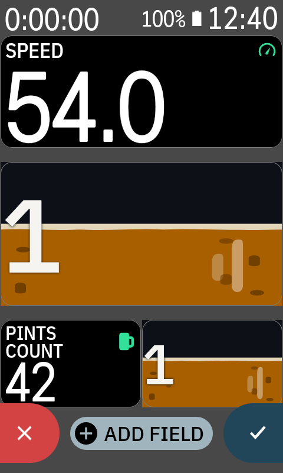

# Pint Progress for Karoo

> Modified by Eric Chernuka for Pint Progress. See [NOTICE](NOTICE) for attribution.

Pint Progress provides two data fields for Hammerhead Karoo cycling computers. Both turn Karoo's
native **Calories from Power** ride total into pints: **Pints Fill** fills the field area behind the
completed-pint count, and **Pints Count** is a native numeric total rendered by Karoo. The
data-field picker lists them in that order.

Upgrading from version 1.1.0 removes the former Pint Mug field. Replace any existing Pint Mug tile
with Pints Fill or Pints Count.

One pint corresponds to **150 kcal** by default, approximately a 12 fl oz / 355 ml 5% ABV beer.
The "pint" name is branding, not a volume measurement. Pints Fill changes in 5% steps, adds a
deeper foam cap from 80%, shows the completed-pint count over the beer texture, and briefly shows a
full-foam and draining transition when a pint completes.

### On-device preview

<table>
  <tr>
    <td></td>
    <td></td>
  </tr>
  <tr>
    <td align="center">Light</td>
    <td align="center">Dark</td>
  </tr>
</table>

*Page-editor captures from a Hammerhead k24 running KOS 1.650.2509. They show Pints Fill across
multiple tile sizes and alignments. The `42` shown by Pints Count is Karoo's host-owned page-editor
placeholder, not extension output.*

Karoo supplies the cumulative calorie value through its `TYPE_CALORIES_ID` stream. Pint Progress
does not calculate calories. Pints Fill converts physical `viewSize` pixels into Android dp, falls
back to grid span when older hosts report `0×0`, fits the completed count within the field, and
applies Karoo's physical left, centre, or right alignment. Pints Count leaves numeric sizing,
alignment, boundaries, and formatting to Karoo. See the [Karoo data-field contract](docs/KAROO_DATA_FIELD_CONTRACT.md)
for the source-backed behavior matrix and required device checks.

## Runtime behavior

- The field subscribes to Karoo's calorie stream only while it is visible.
- Normal rendering changes at 5% fill boundaries or completed-beer boundaries.
- The completion animation has three static frames separated by one second, matching Karoo's limit of one view update per second.
- **Pints Fill** is the first picker entry. Its preview loops through 50% with `0`, 80% with `0`,
  full foam with `1`, and draining with `1` at one-second intervals. Its live field hides the Karoo
  header.
- **Pints Count** publishes a floored decimal total. Karoo displays values such as `0.00`, `0.70`,
  `1.00`, and `12.30` through its native formatter. Its page-editor preview cycles through `0.5`,
  `0.9`, `1`, and `1.1` at one Hz in the extension stream, while the page editor keeps its
  host-owned numeric placeholder. Its value is host- and KOS-version-dependent, so record the
  observed value with exact device and KOS evidence. That placeholder is not extension output.
- Changing the calories-per-beer setting establishes a new steady baseline immediately and never replays a completion animation for calories already recorded.
- Pint Progress spaces every view update at least one second apart. It defers a quick source-state change rather than allowing Karoo to drop it.
- The app has no timer, sensor scan, background job, bitmap allocation, or developer FIT field.

## Build and test

The repository includes the open-source Karoo extension SDK source in `lib/`, so local builds do not need GitHub Packages credentials.

```bash
./gradlew :lib:testDebugUnitTest :pint:testReleaseUnitTest :pint:lintDebug :pint:assembleDebug :pint:assembleRelease :pint:jacocoBehaviorTestCoverageVerification :calorie-source:testDebugUnitTest :calorie-source:lintDebug :calorie-source:assembleDebug
```

This command produces a local debug APK and an intentionally unsigned release APK. It also verifies 100% instruction and branch coverage for every deterministic behavior class: calorie conversion, threshold animation, view-reducer coalescing, preview state, drawable frame selection, labels, counters, and caller authorization. The build checks the thin Android/Karoo boundary against the included official SDK. See [the test boundary policy](docs/TEST_BOUNDARY.md).

## Development install on a Karoo

1. Enable developer mode and USB debugging on the Karoo.
2. Install the debug APK with `adb install -r pint/build/outputs/apk/debug/pint-debug.apk`.
3. Add **Pints Fill** or **Pints Count** under **Pint Progress** to a ride page from the Karoo data-field picker.
4. Start a ride with power-based calories available.

The debug APK is for local development only. Do not attach it to a public release. The verification workflow does not publish debug APKs on normal pushes; a manually dispatched run can produce an explicitly marked, short-lived `UNSAFE-DEBUG` artifact. Its default debug key is ephemeral, so it may require uninstalling a debug APK from a different run. An actual update must use the same project-owned signing key as the installed app. Local release builds are unsigned. The manual release workflow prepares a signed candidate once, then publishes those exact approved bytes after device verification. Only preparation receives signing secrets. See [the release process](docs/RELEASE.md) for candidate identity and approval inputs.

Before using it during a ride, run a short on-device smoke test. Verify Pints Fill at zero and 80%,
the completion transition, Pints Count, a page change, and that the Karoo system can load the
caller-gated extension.

## Security model

- The app requests no Android permissions and contains no network client, storage access, WebView, analytics SDK, native code, or dynamic code loading.
- It consumes only Karoo's cumulative **Calories from Power** stream and renders package-owned static `RemoteViews` resources.
- Android requires the extension service to be exported for Karoo discovery. Every Binder transaction is caller-gated to the Karoo system package (`io.hammerhead.appstore`), malformed view configuration is rejected before parsing, duplicate sessions cancel their predecessor, and active sessions are bounded.
- Verify CI has read-only repository permissions, immutable action pins, no repository secrets, and Gradle SHA-256 dependency verification recorded in `gradle/verification-metadata.xml`.

## Set calories per beer

Open **Pint Progress** from Karoo's app launcher, then choose the ride-calorie target represented by one full mug. The default is **150 kcal**. The slider supports **80–400 kcal** in 5 kcal steps, with buttons for fine adjustment and resetting to 150 kcal.

The preference is global to Pint Progress because the public Karoo extension SDK does not expose custom per-field controls in `ViewConfig`. It is stored only in the app's private preferences. A visible field applies changes immediately; its next genuine threshold crossing still receives the normal bubbles-and-drain animation.

## Contributor documentation

Start with [AGENTS.md](AGENTS.md) for commands and invariants, then use the focused [documentation index](docs/README.md).

## License and attribution

This repository is Apache-2.0. See [NOTICE](NOTICE) for project authorship, vendored-source attribution, and prominent notices for modified upstream files. The included `lib/` directory is the open-source Karoo extension SDK from SRAM, retained under its Apache-2.0 license, sourced from `hammerheadnav/karoo-ext` at commit `f79f103` (SDK 1.1.9).

https://github.com/hammerheadnav/karoo-ext
