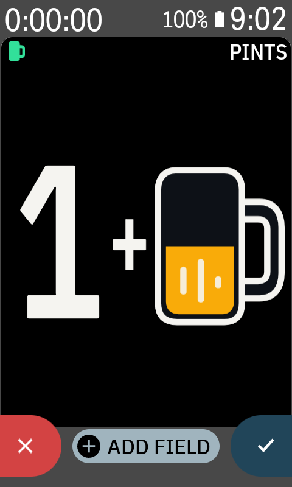
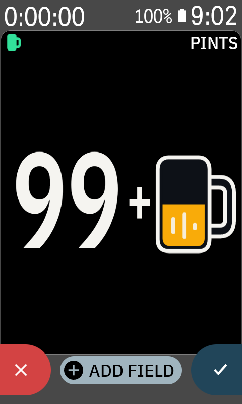
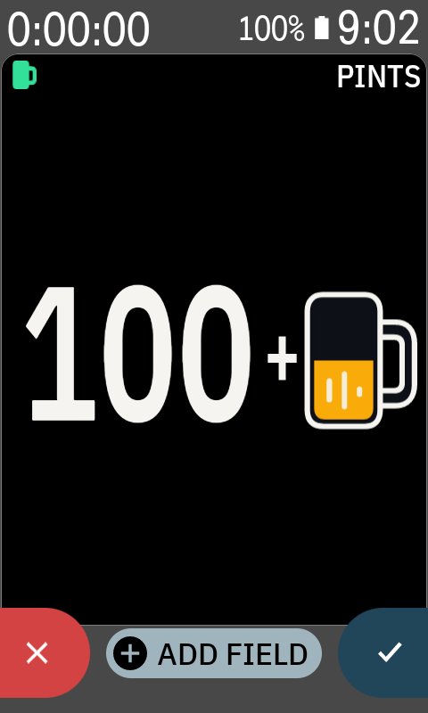

# Pint Progress for Karoo

> Modified by Eric Chernuka for Pint Progress. See [NOTICE](NOTICE) for attribution.

Pint Progress provides two data fields for Hammerhead Karoo cycling computers. Both turn Karoo's
native **Calories from Power** ride total into pints: **Pints** is a graphical filling beer mug, and
**Pints Count** is a native numeric total rendered by Karoo.

One full mug corresponds to **150 kcal** by default, approximately a 12 fl oz / 355 ml 5% ABV beer. The "pint" name is branding, not a volume measurement. The mug fills in 5% steps, adds foam from 80%, crowns the rim with foam when full, shows bubbles when it observes a completion, drains, and starts the next mug. Until the first completed beer, the field shows only the filling mug. Afterwards it shows a compact `N+` count beside the mug.


*Resource-accurate value graphic at 80% to the next beer and `12+` completed. The representative header is owned by Karoo and can vary by device software. The counter uses Android's Roboto Condensed Bold system face through `sans-serif-condensed`, with its visible height matched to the mug. Colors follow Android's light or dark configuration.*

### On-device preview

<table>
  <tr>
    <td></td>
    <td></td>
    <td></td>
  </tr>
  <tr>
    <td align="center"><code>1+</code></td>
    <td align="center"><code>99+</code></td>
    <td align="center"><code>100+</code></td>
  </tr>
</table>

*Page-editor captures from a Hammerhead k24 running KOS 1.650.2509. They show the deterministic graphical preview and its count-to-mug balance at the `1` to `99` and `99` to `100` boundaries.*

Karoo supplies the cumulative calorie value through its `TYPE_CALORIES_ID` stream. Pint Progress does not calculate calories. Its fill level and completed-mug count follow Karoo's native calorie model and active ride state.

The mug field adapts to the allocated Karoo tile: full count plus mug for roomy fields and a reduced count plus mug for narrow, short, or small fields. A completed count remains visible in every live graphical field, including when the compact group must scale below its nominal size. Before the first completed mug, the live field and data-picker preview preserve the mug's aspect ratio while filling the height Karoo actually allocates. Karoo owns the count field's numeric sizing, alignment, and boundaries.

Pint Progress gives every Karoo `ViewConfig` input explicit behavior. It converts physical `viewSize` pixels into the dp units used by Android layouts, with grid span as a fallback for older hosts that report `0×0`. It chooses the regular treatment when it fits, otherwise the compact count-and-mug treatment and scales its typography to the supplied width and height. Karoo's numeric text size is the normal-scale reference. A roomy field can expand the complete count-and-mug group to twice that scale on Android 12 or later; width, height, font scale, and count length still reduce it before the group can clip, including when `99` becomes `100`. Older Android hosts keep the normal scale because their `RemoteViews` API cannot enlarge the mug to match. The selected left/centre/right alignment is applied to the complete rendered group. Karoo owns the standard data-type icon and compact header, while the extension's `RemoteViews` contain only the value graphic. See the [Karoo data-field contract](docs/KAROO_DATA_FIELD_CONTRACT.md) for the source-backed behavior matrix and required device checks.

## Runtime behavior

- The field subscribes to Karoo's calorie stream only while it is visible.
- Normal rendering changes at 5% fill boundaries or completed-beer boundaries.
- The completion animation has three static frames separated by one second, matching Karoo's limit of one view update per second.
- The graphical mug preview loops through 50%, 80%, and full-with-bubbles frames at the same one-second cadence.
- The graphical mug preview then shows `1+`, `99+`, and `100+` at one-second intervals so picker
  sizing for count transitions is directly observable.
- **Pints Count** publishes a floored decimal total. Karoo displays values such as `0.00`, `0.70`,
  `1.00`, and `12.30` through its native formatter. Its page-editor preview cycles through `0.5`,
  `0.9`, `1`, and `1.1` at one Hz in the extension stream, while the page editor keeps its
  host-owned numeric placeholder. Its value is host- and KOS-version-dependent, so record the
  observed value with exact device and KOS evidence. That placeholder is not extension output.
- Changing the calories-per-beer setting establishes a new steady baseline immediately and never replays a completion animation for calories already recorded.
- Pint Progress spaces every view update at least one second apart. It defers a quick source-state change rather than allowing Karoo to drop it.
- The app has no timer, sensor scan, background job, bitmap allocation, or developer FIT field.

## Build and test

The repository includes the open-source Karoo extension SDK source in `lib/`, so local builds do not need GitHub Packages credentials.

```bash
./gradlew :lib:testDebugUnitTest :pint:testReleaseUnitTest :pint:lintDebug :pint:assembleDebug :pint:assembleRelease :pint:jacocoBehaviorTestCoverageVerification
```

This command produces a local debug APK and an intentionally unsigned release APK. It also verifies 100% instruction and branch coverage for every deterministic behavior class: calorie conversion, threshold animation, view-reducer coalescing, preview state, drawable frame selection, labels, counters, and caller authorization. The build checks the thin Android/Karoo boundary against the included official SDK. See [the test boundary policy](docs/TEST_BOUNDARY.md).

## Development install on a Karoo

1. Enable developer mode and USB debugging on the Karoo.
2. Install the debug APK with `adb install -r pint/build/outputs/apk/debug/pint-debug.apk`.
3. Add **Pints** or **Pints Count** under **Pint Progress** to a ride page from the Karoo data-field picker.
4. Start a ride with power-based calories available.

The debug APK is for local development only. Do not attach it to a public release. The verification workflow does not publish debug APKs on normal pushes; a manually dispatched run can produce an explicitly marked, short-lived `UNSAFE-DEBUG` artifact. Its default debug key is ephemeral, so it may require uninstalling a debug APK from a different run. An actual update must use the same project-owned signing key as the installed app. The release build is deliberately unsigned unless the tag-only release workflow receives the protected signing secrets: any distributable release must be rebuilt from an audited commit, signed with that private key, and published with its version, commit, and SHA-256 recorded.

Before using it during a ride, run a short on-device smoke test. Verify initial rendering, the 80% foam state, a completion animation, a page change, and that the Karoo system can load the caller-gated extension.

## Security model

- The app requests no Android permissions and contains no network client, storage access, WebView, analytics SDK, native code, or dynamic code loading.
- It consumes only Karoo's cumulative **Calories from Power** stream and renders package-owned static `RemoteViews` resources.
- Android requires the extension service to be exported for Karoo discovery. Every Binder transaction is caller-gated to the Karoo system package (`io.hammerhead.appstore`), malformed view configuration is rejected before parsing, duplicate sessions cancel their predecessor, and active sessions are bounded.
- CI has read-only repository permissions, immutable action pins, no repository secrets, and Gradle SHA-256 dependency verification recorded in `gradle/verification-metadata.xml`.

## Set calories per beer

Open **Pint Progress** from Karoo's app launcher, then choose the ride-calorie target represented by one full mug. The default is **150 kcal**. The slider supports **80–400 kcal** in 5 kcal steps, with buttons for fine adjustment and resetting to 150 kcal.

The preference is global to Pint Progress because the public Karoo extension SDK does not expose custom per-field controls in `ViewConfig`. It is stored only in the app's private preferences. A visible field applies changes immediately; its next genuine threshold crossing still receives the normal bubbles-and-drain animation.

## Contributor documentation

Start with [AGENTS.md](AGENTS.md) for commands and invariants, then use the focused [documentation index](docs/README.md).

## License and attribution

This repository is Apache-2.0. See [NOTICE](NOTICE) for project authorship, vendored-source attribution, and prominent notices for modified upstream files. The included `lib/` directory is the open-source Karoo extension SDK from SRAM, retained under its Apache-2.0 license, sourced from `hammerheadnav/karoo-ext` at commit `f79f103` (SDK 1.1.9).

https://github.com/hammerheadnav/karoo-ext
