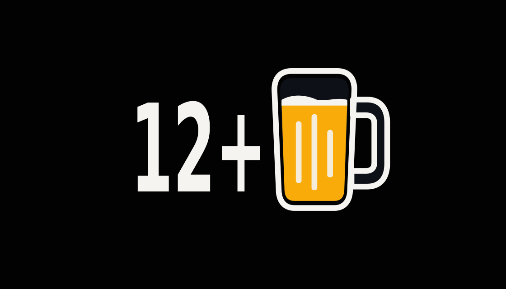

# Pint Progress for Karoo

> Modified by Eric Chernuka for Pint Progress. See [NOTICE](NOTICE) for attribution.

Pint Progress is a graphical data field for Hammerhead Karoo cycling computers. It turns Karoo's native **Calories from Power** ride total into a beer mug that fills as the total rises.

One full mug corresponds to **150 kcal** by default, approximately a 12 fl oz / 355 ml 5% ABV beer. The "pint" name is branding, not a volume measurement. The mug fills in 5% steps, adds foam from 80%, shows bubbles when it observes a completion, drains, and starts the next mug. Until the first completed beer, the field shows only the filling mug. Afterwards it shows a compact `N+` count beside the mug.



*Resource-accurate preview at 80% to the next beer and `12+` completed. The counter uses Android's Roboto Condensed Bold system face through `sans-serif-condensed`, with its visible height matched to the mug. Colors follow Android's light or dark configuration. Karoo host chrome varies by device software and is not shown.*

Karoo supplies the cumulative calorie value through its `TYPE_CALORIES_ID` stream. Pint Progress does not calculate calories. Its fill level and completed-mug count follow Karoo's native calorie model and active ride state.

The graphical field adapts to the allocated Karoo tile: full count plus mug for roomy fields, a reduced count plus mug for narrow or short fields, and a live mug-only treatment where a readable counter cannot fit. The data-picker preview uses its own compact mug so it is never cropped by the picker card.

Pint Progress gives every Karoo `ViewConfig` input explicit behavior. It converts physical `viewSize` pixels into the dp units used by Android layouts, with grid span as a fallback for older hosts that report `0×0`. It chooses the largest treatment whose mug, counter, and configured boundary inset fit. Karoo's numeric text size is a ceiling; the live width budget, font scale, and count length reduce it before the complete group can clip, including when `99` becomes `100`. The selected left/centre/right alignment is applied to the complete count-and-mug group, and preview mode uses the dedicated picker treatment.

## Runtime behavior

- The field subscribes to Karoo's calorie stream only while it is visible.
- Normal rendering changes at 5% fill boundaries or completed-beer boundaries.
- The completion animation has three static frames separated by one second, matching Karoo's limit of one view update per second.
- Pint Progress spaces every view update at least one second apart. It defers a quick source-state change rather than allowing Karoo to drop it.
- The app has no timer, sensor scan, background job, bitmap allocation, or developer FIT field.

## Build and test

The repository includes the open-source Karoo extension SDK source in `lib/`, so local builds do not need GitHub Packages credentials.

```bash
./gradlew :lib:testDebugUnitTest :pint:lintDebug :pint:assembleDebug :pint:assembleRelease :pint:jacocoBehaviorTestCoverageVerification
```

This command produces a local debug APK and an intentionally unsigned release APK. It also verifies 100% instruction and branch coverage for every deterministic behavior class: calorie conversion, threshold animation, view-reducer coalescing, preview state, drawable frame selection, labels, counters, and caller authorization. The build checks the thin Android/Karoo boundary against the included official SDK. See [the test boundary policy](docs/TEST_BOUNDARY.md).

## Development install on a Karoo

1. Enable developer mode and USB debugging on the Karoo.
2. Install the debug APK with `adb install -r pint/build/outputs/apk/debug/pint-debug.apk`.
3. Add **Pint Progress** to a ride page from the Karoo data-field picker.
4. Start a ride with power-based calories available.

The debug APK is for local development only. Do not attach it to a public release. The release build is deliberately unsigned: any distributable release must be rebuilt from an audited commit, signed with a project-owned release key, and published with its commit and SHA-256 recorded.

Before using it during a ride, run a short on-device smoke test. Verify initial rendering, the 80% foam state, a completion animation, a page change, and that the Karoo system can load the caller-gated extension.

## Security model

- The app requests no Android permissions and contains no network client, storage access, WebView, analytics SDK, native code, or dynamic code loading.
- It consumes only Karoo's cumulative **Calories from Power** stream and renders package-owned static `RemoteViews` resources.
- Android requires the extension service to be exported for Karoo discovery. Every Binder transaction is caller-gated to the Karoo system package (`io.hammerhead.appstore`), malformed view configuration is rejected before parsing, duplicate sessions cancel their predecessor, and active sessions are bounded.
- CI has read-only repository permissions, immutable action pins, no repository secrets, and Gradle SHA-256 dependency verification recorded in `gradle/verification-metadata.xml`.

## Customize the drink target

To change the target, edit `DEFAULT_BEER_CALORIES` in `pint/src/main/kotlin/io/ericchernuka/pintprogress/core/PintProgressReducer.kt`, then rebuild and reinstall the app. The target is a compile-time constant, which makes the result deterministic during a ride and keeps the runtime path small. The app does not currently have a settings screen for this value.

## License and attribution

This repository is Apache-2.0. See [NOTICE](NOTICE) for project authorship, vendored-source attribution, and prominent notices for modified upstream files. The included `lib/` directory is the open-source Karoo extension SDK from SRAM, retained under its Apache-2.0 license, sourced from `hammerheadnav/karoo-ext` at commit `f79f103` (SDK 1.1.9).

https://github.com/hammerheadnav/karoo-ext
